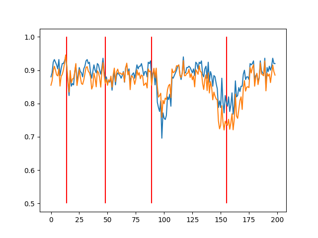

# Stream generation through real concept's interpolation

> Among the recently published works in the field of data stream analysis – both in the context of classification task and concept drift detection – the deficit of real-world data streams is a recurring problem. This article proposes a method for generating data streams with given parameters based on real-world static data. The method uses one-dimensional interpolation to generate sudden or incremental concept drifts. The generated streams were subjected to an exemplary analysis in the concept drift detection task with a detector ensemble. The method can potentially contribute to the development of methods focused on data stream processing.


## Example of use:

```python
import numpy as np
from generator import ip_stream_generator

db = np.genfromtxt("datasets/liver.csv", delimiter=",")
X = db[:, :-1]
y_ = db[:, -1].astype(int)

X_s, y = ip_stream_generator(X, y_, 
                    total_samples=100000,
                    stream_features=10, 
                    random_state=1203, 
                    n_drifts=4, 
                    interpolation='cubic',
                    stabilize_factor=0.15,
                    binarize=False)

ds = np.concatenate((X_s, y[:, np.newaxis]), axis=1)
np.save('stream', ds)
```



